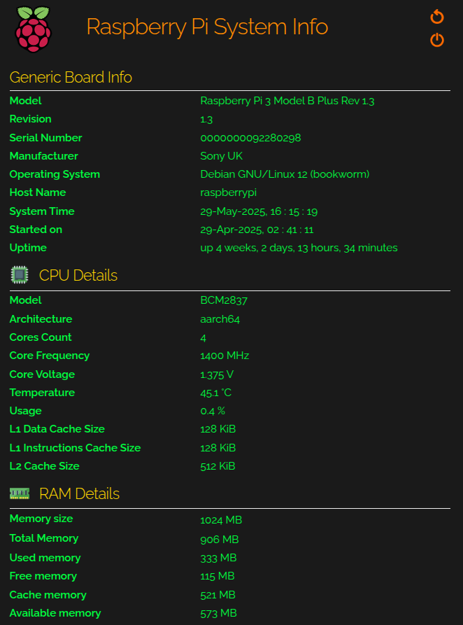

# Raspberry Pi system info

This project is a simple web server that displays system information about your Raspberry Pi.

    

The information includes the board model, hostname, OS details, CPU (type, architecture, revision, serial number, number of cores, frequency, voltage, temperature, usage), RAM (total, used, free, cache, available), network interfaces (ip, mac), mounted disks and processes running in the system. 

Information about disks and processes is displayed in tables. You can sort the tables by clicking on the column in the header

The web server is based on Flask framework. By default the application will run on port 8080. It can be changed in env file.

Gunicorn is used to launch. Use run.sh to run project.
