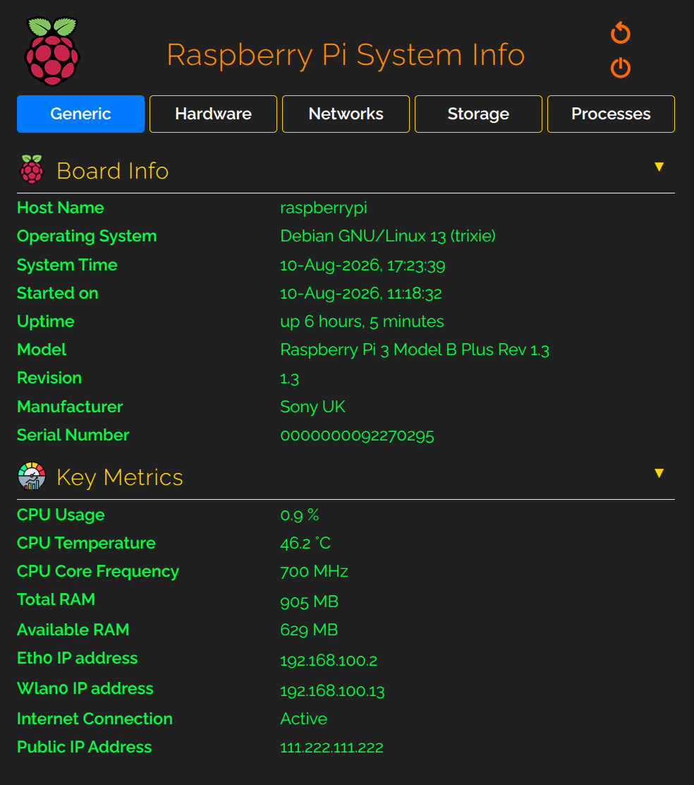

# RPi System Info

[](https://www.raspberrypi.com/)
[](https://flask.palletsprojects.com/)

[](https://mypy-lang.org/)
[](https://opensource.org/licenses/MIT)


This project is a simple web server that displays system information about your Raspberry Pi.

<div align="center">
    
</div>

The interface is divided into 4 tabs:
- 1️⃣  *General*: 
    - Board Info: host name, operating system, system time and uptime, model, revision, manufacturer, serial number. 
    - Key Metrics: CPU usage, CPU temperature, CPU core frequency, total RAM, available RAM, Eth0 and Wlan0 interfaces IP addresses, internet connection status and public IP (if connections is active).
- 2️⃣  *Hardware*:
    - CPU Info: model, architecture, cores count, cores frequency (current, min, max), cores voltage, temperature, usage, cache sizes, overvoltage allowed, OTP programming allowed, OTP reading allowed).
    - RAM Info: size, total, used, free, cache, available.
    - GPU Info: memory size (from RAM), codecs status (for MPG2, WVC1, MPG4, MJPG, WMV9).
- 3️⃣  *Networks*:
    - Ethernet Adapter Info for Eth0 interface: MAC and IP adresses, default gateway, network mask, broadcast IP adress.
    - Wi-Fi Afapter Info for Wlan0 interface: MAC and IP adresses, default gateway, network mask, broadcast IP adress, Wi-Fi network name (if connected).
    - Available Wi-Fi Networks: SSID, channel, rate, signal, bars, security). If the networks list only shows the network the Raspberry Pi is connected to, you need to force a scan using the `sudo nmcli dev wifi rescan` command. This will be fixed in future versions.
    - Bluetooth Adapter Info (for hci0 interface): MAC address.
- 4️⃣  *Storage*:
    - SD Card Info: name, device, serial number, manufacturer id, registers info and other.
    - Disks Usage Info: file system, size, used, available, used%, mounted on.
    - Disks Inodes Info: file system, inodes, used, free, used%, mounted on.
- 5️⃣  *Processes*:
    - Running Processes Info: shows only running tasks (user, PID, CPU%, MEM%, command, started on time).
    - Tmux Sessions Info: show active tmux sessions info (name, windows in the session, created time).

The contents of the tabs are loaded dynamically when they are opened.

Some information is parsed from the device's [revision code](https://www.raspberrypi.com/documentation/computers/raspberry-pi.html#raspberry-pi-revision-codes) located in /proc/cpuinfo.

Information about Wi-Fi networks, disks, processes, tmux sesions is presented in the form of tables. You can sort the tables by clicking on the column in the header.

The web server is based on Flask framework. By default the application will run on port 8080. It can be changed in env file. Gunicorn is used to launch.

## 🚀 Quick start

### Prerequisites
Clone repository:
```bash 
git clone https://github.com/Nkeramov/rpi_system_info.git
```
Switch to repo directory:
```bash 
cd rpi_system_info
```
### Traditional method with venv and pip
Create and activate virtual environment:
```bash 
python -m venv .venv 
source .venv/bin/activate       # Linux/Mac
# or
./venv/Scripts/activate         # Windows
```
Install dependencies and run:
```bash
pip install -r requirements.txt
gunicorn --bind 0.0.0.0:8080 main:app
```
### Modern method with uv
Install dependencies and create virtual environment automatically:
```bash
uv sync
```
Run the project (virtual environment is handled automatically):
```bash
uv run gunicorn --bind 0.0.0.0:8080 main:app
```
Or with explicit activation:
```bash
source .venv/bin/activate       # After uv sync
gunicorn --bind 0.0.0.0:8080 main:app
```

Also you can use the launch script `run.sh`, making it executable first
```bash
chmod +x run.sh
```

## 🛠️  Configuration 

The configuration file is located in the `.env` file. You can copy the `env.example` to `.env` and make your edits.
```bash
cp env.example .env
```

## ⚙️  Adding to startup

You can set up automatic script launch at system startup.

Open the `/etc/rc.local` file in editor:
```bash
sudo nano /etc/rc.local
```
Add to the end of file this line:
```bash
/home/pi/rpi_system_info/run.sh &
```
Press Ctrl+O → Enter → Ctrl+X to save and exit.

## 🤝 Contributing

If you want to contribute, please follow these steps:

1. Fork the repository.
2. Create a new branch for your feature or bug fix.
3. Make your changes and commit them.
4. Push to your fork and create a pull request.

## 📝 License

This project is licensed under the MIT License. See the [LICENSE](LICENSE) file for details.

## 📚 References 

- [Getting started](https://www.raspberrypi.com/documentation/computers/getting-started.html)
- [Raspberry Pi OS](https://www.raspberrypi.com/documentation/computers/os.html)
- [Processors](https://www.raspberrypi.com/documentation/computers/processors.html)
- [Raspberry Pi hardware](https://www.raspberrypi.com/documentation/computers/raspberry-pi.html)
- [Raspberry Pi revision codes](https://www.raspberrypi.com/documentation/computers/raspberry-pi.html#raspberry-pi-revision-codes)
- [How to Benchmark a Raspberry Pi Using Vcgencmd](https://www.tomshardware.com/how-to/raspberry-pi-benchmark-vcgencmd)
